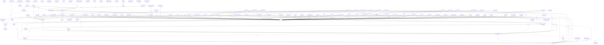

```mermaid
erDiagram

  "staff_groups" {

    }
  

  "user_ranks" {

    }
  

  "rank_promotion_rules" {

    }
  

  "user_settings" {

    }
  

  "users" {

    }
  

  "user_secondary_ranks" {

    }
  

  "invites" {

    }
  

  "invite_trees" {

    }
  

  "friend_relationships" {

    }
  

  "profiles" {

    }
  

  "stylesheets" {

    }
  

  "author_stylesheets" {

    }
  

  "assets" {

    }
  

  "forum_categories" {

    }
  

  "forums" {

    }
  

  "forum_topics" {

    }
  

  "forum_posts" {

    }
  

  "forum_post_edits" {

    }
  

  "forum_polls" {

    }
  

  "forum_poll_votes" {

    }
  

  "forum_last_read_topics" {

    }
  

  "forum_topic_notes" {

    }
  

  "forum_specific_rules" {

    }
  

  "threads" {

    }
  

  "artists" {

    }
  

  "artist_histories" {

    }
  

  "artist_aliases" {

    }
  

  "artist_tags" {

    }
  

  "release_tags" {

    }
  

  "release_tag_votes" {

    }
  

  "artist_subscriptions" {

    }
  

  "concerts" {

    }
  

  "similar_artists" {

    }
  

  "communities" {

    }
  

  "consumers" {

    }
  

  "contributors" {

    }
  

  "releases" {

    }
  

  "contributions" {

    }
  

  "release_files" {

    }
  

  "release_artists" {

    }
  

  "editions" {

    }
  

  "do_not_contribute" {

    }
  

  "comments" {

    }
  

  "donations" {

    }
  

  "bitcoin_donations" {

    }
  

  "donor_forum_usernames" {

    }
  

  "donor_rewards" {

    }
  

  "collages" {

    }
  

  "collage_entries" {

    }
  

  "collage_subscriptions" {

    }
  

  "bookmark_artists" {

    }
  

  "bookmark_collages" {

    }
  

  "bookmark_releases" {

    }
  

  "bookmark_communities" {

    }
  

  "bookmark_requests" {

    }
  

  "requests" {

    }
  

  "request_bounties" {

    }
  

  "request_artists" {

    }
  

  "economy_transactions" {

    }
  

  "request_actions" {

    }
  

  "request_fills" {

    }
  

  "download_access_grants" {

    }
  

  "ratio_policy_states" {

    }
  

  "contribution_reports" {

    }
  

  "blogs" {

    }
  

  "contest_types" {

    }
  

  "cover_art" {

    }
  

  "featured_albums" {

    }
  

  "featured_merch" {

    }
  

  "subscriptions" {

    }
  

  "comment_subscriptions" {

    }
  

  "notifications" {

    }
  

  "tags" {

    }
  

  "tag_aliases" {

    }
  

  "release_histories" {

    }
  

  "posts" {

    }
  

  "post_comments" {

    }
  

  "news" {

    }
  

  "global_notices" {

    }
  

  "applicants" {

    }
  

  "notes" {

    }
  

  "api_applications" {

    }
  

  "api_users" {

    }
  

  "bad_passwords" {

    }
  

  "currency_conversion_rates" {

    }
  

  "email_blacklists" {

    }
  

  "ip_bans" {

    }
  

  "group_logs" {

    }
  

  "audit_logs" {

    }
  

  "private_conversations" {

    }
  

  "private_conversation_participants" {

    }
  

  "private_messages" {

    }
  

  "staff_inbox_conversations" {

    }
  

  "staff_inbox_messages" {

    }
  

  "staff_inbox_responses" {

    }
  

  "reports" {

    }
  

  "report_notes" {

    }
  

  "site_settings" {

    }
  

  "user_sessions" {

    }
  

  "account_recoveries" {

    }
  

  "user_email_histories" {

    }
  

  "user_warnings" {

    }
  

  "user_moderation_notes" {

    }
  

  "donor_ranks" {

    }
  

  "user_donor_ranks" {

    }
  

  "request_votes" {

    }
  

  "pm_drafts" {

    }
  

  "mass_messages" {

    }
  

  "site_history" {

    }
  

  "wiki_pages" {

    }
  

  "wiki_revisions" {

    }
  

  "wiki_aliases" {

    }
  

  "rules_pages" {

    }
  

  "rules" {

    }
  

  "sub_rules" {

    }
  

  "release_votes" {

    }
  

  "release_vote_aggregates" {

    }
  

  "top10_snapshots" {

    }
  

  "top10_snapshot_entries" {

    }
  

  "user_stat_snapshots" {

    }
  

  "site_stat_snapshots" {

    }
  

  "community_health_snapshots" {

    }
  

  "crs_snapshots" {

    }
  

  "dev_seed_runs" {

    }
  

  "dev_seed_records" {

    }
  

  "dev_seed_mutations" {

    }
  
    "user_ranks" }o--|o staff_groups : "staffGroup"
    "rank_promotion_rules" }o--|| user_ranks : "fromRank"
    "rank_promotion_rules" }o--|| user_ranks : "toRank"
    "user_settings" }o--|o author_stylesheets : "activeAuthorStylesheet"
    "users" }o--|| user_ranks : "userRank"
    "users" |o--|| user_settings : "userSettings"
    "users" |o--|| profiles : "profile"
    "users" o{--}o "communities" : ""
    "user_secondary_ranks" }o--|| users : "user"
    "user_secondary_ranks" }o--|| user_ranks : "userRank"
    "user_secondary_ranks" }o--|o users : "assignedBy"
    "invites" }o--|| users : "inviter"
    "invite_trees" |o--|| users : "user"
    "invite_trees" }o--|o users : "inviter"
    "friend_relationships" }o--|| users : "requester"
    "friend_relationships" }o--|| users : "recipient"
    "author_stylesheets" }o--|| users : "author"
    "assets" }o--|o users : "owner"
    "forums" }o--|| forum_categories : "forumCategory"
    "forums" }o--|o forum_topics : "lastTopic"
    "forum_topics" }o--|| forums : "forum"
    "forum_topics" }o--|o threads : "thread"
    "forum_topics" }o--|| users : "author"
    "forum_topics" }o--|o forum_posts : "lastPost"
    "forum_posts" }o--|| forum_topics : "forumTopic"
    "forum_posts" }o--|| users : "author"
    "forum_post_edits" }o--|| forum_posts : "forumPost"
    "forum_post_edits" }o--|| users : "editor"
    "forum_polls" |o--|| forum_topics : "forumTopic"
    "forum_poll_votes" }o--|| forum_polls : "forumPoll"
    "forum_last_read_topics" }o--|| forum_topics : "forumTopic"
    "forum_last_read_topics" }o--|| forum_posts : "forumPost"
    "forum_topic_notes" }o--|| forum_topics : "forumTopic"
    "forum_topic_notes" }o--|| users : "author"
    "forum_specific_rules" }o--|o forums : "forum"
    "forum_specific_rules" }o--|o threads : "thread"
    "forum_specific_rules" }o--|o forum_topics : "forumTopic"
    "artists" o{--}o "contributions" : ""
    "artist_histories" }o--|| artists : "artist"
    "artist_histories" }o--|| users : "editedUser"
    "artist_aliases" }o--|| artists : "artist"
    "artist_aliases" }o--|| artists : "redirect"
    "artist_tags" }o--|| artists : "artist"
    "artist_tags" }o--|| tags : "tag"
    "release_tags" }o--|| releases : "release"
    "release_tags" }o--|| tags : "tag"
    "release_tags" }o--|o users : "user"
    "release_tag_votes" }o--|| release_tags : "releaseTag"
    "release_tag_votes" }o--|| users : "user"
    "artist_subscriptions" }o--|| users : "user"
    "artist_subscriptions" }o--|| artists : "artist"
    "concerts" }o--|| artists : "artist"
    "concerts" |o--|| forum_topics : "forumTopic"
    "similar_artists" }o--|| artists : "artist"
    "similar_artists" }o--|| artists : "similarArtist"
    "communities" o{--}o "consumers" : ""
    "communities" }o--|o users : "leader"
    "consumers" |o--|| users : "user"
    "consumers" o{--}o "releases" : ""
    "consumers" o{--}o "contributions" : ""
    "contributors" |o--|| users : "user"
    "contributors" }o--|| communities : "community"
    "contributors" o{--}o "releases" : ""
    "releases" }o--|o communities : "community"
    "contributions" }o--|| users : "user"
    "contributions" }o--|| releases : "release"
    "contributions" }o--|| contributors : "contributor"
    "contributions" }o--|| editions : "edition"
    "release_files" |o--|| contributions : "contribution"
    "release_artists" }o--|| releases : "release"
    "release_artists" }o--|| artists : "artist"
    "editions" }o--|| releases : "release"
    "do_not_contribute" }o--|| communities : "community"
    "comments" }o--|| users : "author"
    "comments" }o--|o users : "editedUser"
    "comments" }o--|o artists : "artist"
    "comments" }o--|o communities : "community"
    "comments" }o--|o contributions : "contribution"
    "comments" }o--|o requests : "request"
    "comments" }o--|o releases : "release"
    "comments" }o--|o collages : "collage"
    "donations" }o--|| users : "user"
    "donor_forum_usernames" |o--|| users : "user"
    "donor_rewards" |o--|| users : "user"
    "collages" }o--|| users : "user"
    "collage_entries" }o--|| collages : "collage"
    "collage_entries" }o--|| releases : "release"
    "collage_entries" }o--|| users : "user"
    "collage_subscriptions" }o--|| users : "user"
    "collage_subscriptions" }o--|| collages : "collage"
    "bookmark_artists" }o--|| users : "user"
    "bookmark_artists" }o--|| artists : "artist"
    "bookmark_collages" }o--|| users : "user"
    "bookmark_collages" }o--|| collages : "collage"
    "bookmark_releases" }o--|| users : "user"
    "bookmark_releases" }o--|| releases : "release"
    "bookmark_communities" }o--|| users : "user"
    "bookmark_communities" }o--|| communities : "community"
    "bookmark_requests" }o--|| users : "user"
    "bookmark_requests" }o--|| requests : "request"
    "requests" }o--|| communities : "community"
    "requests" }o--|| users : "user"
    "requests" }o--|o users : "filler"
    "requests" }o--|o contributions : "filledContribution"
    "request_bounties" }o--|| requests : "request"
    "request_bounties" }o--|| users : "user"
    "request_artists" }o--|| requests : "request"
    "request_artists" }o--|| artists : "artist"
    "economy_transactions" }o--|| users : "user"
    "economy_transactions" }o--|o users : "actor"
    "request_actions" }o--|| requests : "request"
    "request_actions" }o--|| users : "actor"
    "request_fills" }o--|| requests : "request"
    "request_fills" }o--|| contributions : "contribution"
    "request_fills" }o--|| users : "filler"
    "download_access_grants" }o--|| users : "consumer"
    "download_access_grants" }o--|| users : "contributor"
    "download_access_grants" }o--|| contributions : "contribution"
    "download_access_grants" }o--|o users : "reversedBy"
    "ratio_policy_states" |o--|| users : "user"
    "contribution_reports" }o--|| contributions : "contribution"
    "contribution_reports" }o--|| users : "reporter"
    "blogs" }o--|| users : "user"
    "subscriptions" }o--|| users : "user"
    "comment_subscriptions" }o--|| users : "user"
    "notifications" }o--|| users : "user"
    "notifications" }o--|o users : "actor"
    "tag_aliases" }o--|| tags : "goodTag"
    "tag_aliases" }o--|| users : "createdBy"
    "release_histories" }o--|| releases : "release"
    "release_histories" }o--|| users : "actor"
    "posts" }o--|| users : "user"
    "post_comments" }o--|| posts : "post"
    "post_comments" }o--|| users : "user"
    "global_notices" }o--|| users : "createdBy"
    "applicants" }o--|| users : "user"
    "applicants" }o--|| threads : "thread"
    "notes" }o--|| threads : "thread"
    "notes" }o--|| users : "user"
    "api_applications" }o--|| users : "user"
    "api_users" }o--|| users : "user"
    "api_users" }o--|| api_applications : "apiApplication"
    "audit_logs" }o--|| users : "actor"
    "private_conversation_participants" }o--|| users : "user"
    "private_conversation_participants" }o--|| private_conversations : "conversation"
    "private_messages" }o--|| private_conversations : "conversation"
    "private_messages" }o--|o users : "sender"
    "staff_inbox_conversations" }o--|| users : "user"
    "staff_inbox_conversations" }o--|o users : "assignedUser"
    "staff_inbox_conversations" }o--|o users : "resolver"
    "staff_inbox_messages" }o--|| staff_inbox_conversations : "conversation"
    "staff_inbox_messages" }o--|| users : "sender"
    "reports" }o--|| users : "reporter"
    "reports" }o--|o users : "claimedBy"
    "reports" }o--|o users : "resolvedBy"
    "report_notes" }o--|| reports : "report"
    "report_notes" }o--|| users : "author"
    "user_sessions" }o--|| users : "user"
    "account_recoveries" }o--|| users : "user"
    "user_email_histories" }o--|| users : "user"
    "user_warnings" }o--|| users : "user"
    "user_warnings" }o--|| users : "warnedBy"
    "user_moderation_notes" }o--|| users : "user"
    "user_moderation_notes" }o--|| users : "author"
    "user_donor_ranks" |o--|| users : "user"
    "user_donor_ranks" }o--|| donor_ranks : "donorRank"
    "request_votes" }o--|| requests : "request"
    "request_votes" }o--|| users : "user"
    "pm_drafts" }o--|| users : "user"
    "mass_messages" }o--|| users : "sender"
    "site_history" }o--|| users : "author"
    "wiki_pages" }o--|| users : "author"
    "wiki_revisions" }o--|| wiki_pages : "page"
    "wiki_revisions" }o--|| users : "author"
    "wiki_aliases" }o--|| wiki_pages : "page"
    "wiki_aliases" }o--|| users : "user"
    "rules_pages" }o--|| users : "author"
    "sub_rules" }o--|| rules : "rule"
    "release_votes" }o--|| releases : "release"
    "release_votes" }o--|| users : "user"
    "release_vote_aggregates" |o--|| releases : "release"
    "top10_snapshot_entries" }o--|| top10_snapshots : "snapshot"
    "top10_snapshot_entries" }o--|o releases : "release"
    "user_stat_snapshots" }o--|| users : "user"
    "community_health_snapshots" }o--|| communities : "community"
    "crs_snapshots" }o--|| users : "user"
    "dev_seed_records" }o--|| dev_seed_runs : "run"
    "dev_seed_mutations" }o--|| dev_seed_runs : "run"
```
